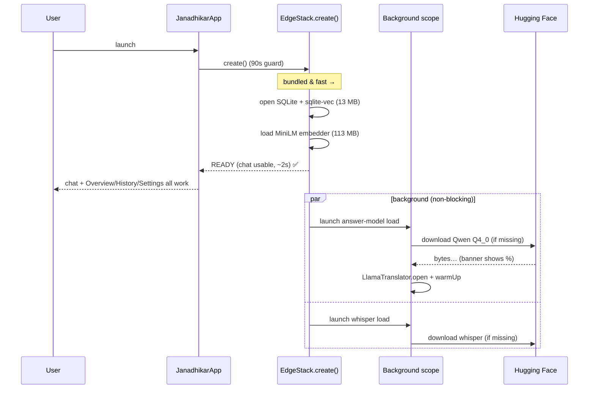
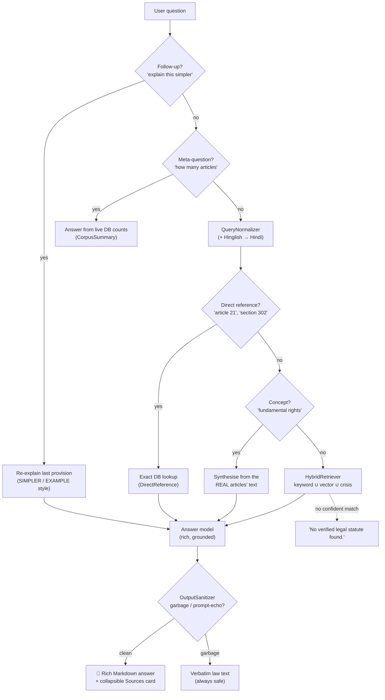
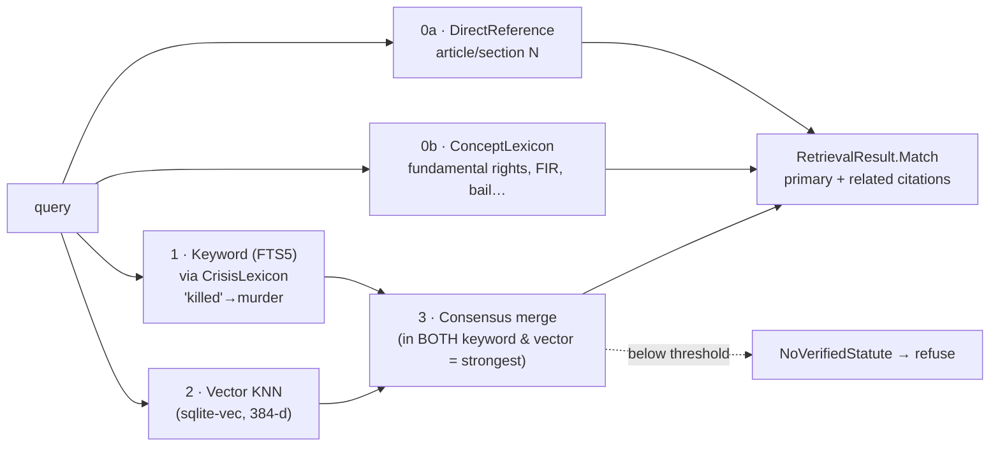
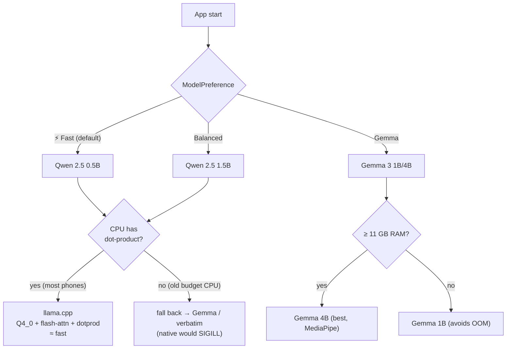
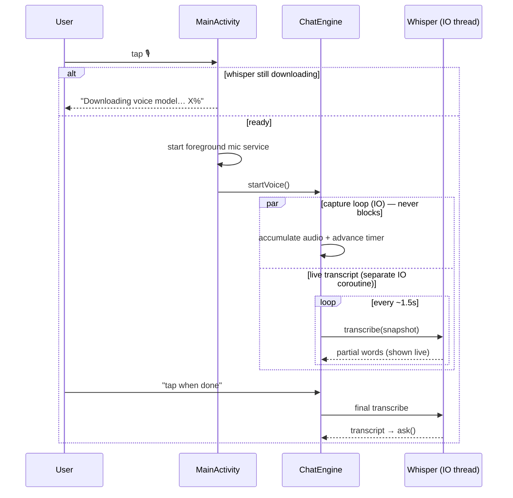
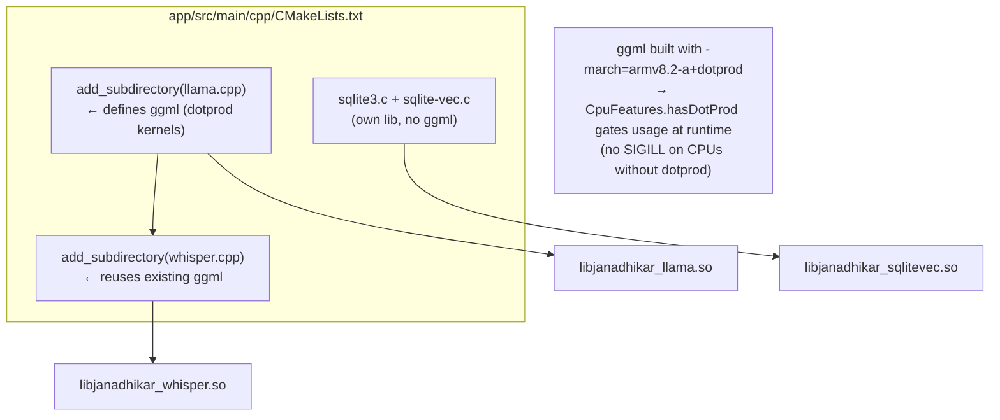
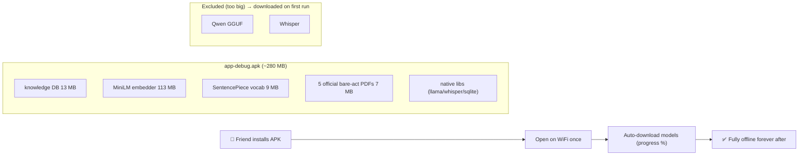
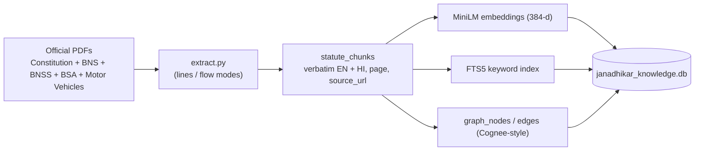

# 🏛 Janadhikar — Architecture

> An on-device legal assistant for Indian citizens. Ask about your rights in
> plain words (typed or spoken, English/Hindi/Hinglish) and get a clear,
> grounded answer with the exact law behind it — running **on the phone** after
> a one-time model download.

This document is the single source of truth for how the app is put together.
All diagrams are [Mermaid](https://mermaid.js.org/) and render inline on GitHub.

---

## 1. The big picture

```mermaid
flowchart TB
    subgraph User["👤 User"]
        T["⌨️ Typed question<br/>(EN / HI / Hinglish)"]
        V["🎙️ Spoken question"]
    end

    subgraph App["📱 Janadhikar (Android · Kotlin · Compose)"]
        direction TB
        UI["Compose UI<br/>chat · overview · history · settings · PDF viewer"]
        ENG["ChatEngine<br/>orchestrates every turn"]

        subgraph Memory["🧠 Memory layer (offline)"]
            RET["HybridRetriever"]
            DB[("SQLite + sqlite-vec + FTS5<br/>bundled 13 MB")]
            EMB["MiniLM embedder<br/>bundled 113 MB (LiteRT)"]
        end

        subgraph Brains["🤖 Answer models (pick one)"]
            QWEN["Qwen 2.5 0.5B / 1.5B<br/>llama.cpp · CPU · Q4_0"]
            GEMMA["Gemma 3 1B / 4B<br/>MediaPipe · accelerated"]
            VERB["Verbatim law<br/>(always-safe fallback)"]
        end

        VOICE["Whisper (STT)<br/>llama.cpp/ggml"]
    end

    subgraph Net["🌐 Network — used ONCE"]
        HF["Hugging Face<br/>model download on first run"]
    end

    T --> ENG
    V --> VOICE --> ENG
    ENG --> RET
    RET --> DB
    RET --> EMB
    ENG --> QWEN
    ENG --> GEMMA
    ENG --> VERB
    HF -. "first-run download<br/>(Qwen GGUF, Whisper)" .-> Brains
    HF -. .-> VOICE
    ENG --> UI

    classDef offline fill:#0d1b2a,stroke:#7EE0B0,color:#e0e0e0
    classDef net fill:#3a1a1a,stroke:#FFD600,color:#fff
    class Memory,Brains,VOICE offline
    class Net,HF net
```

**The trust model:** every *question, transcript, and answer stays on the
device.* Network is touched **exactly once** — the first-run download of the AI
model (too large to bundle in a shareable APK). After that the app is fully
offline. The knowledge base, the search embedder, and the official PDFs ship
**inside** the APK.

---

## 2. Layers & key files

```mermaid
flowchart LR
    subgraph P["Presentation · com.janadhikar.ui"]
        CS["ChatScreen"]
        OV["ConstitutionOverviewScreen"]
        HS["HistoryScreen"]
        SS["SettingsScreen"]
        PV["PdfViewerScreen"]
        MD["MarkdownText<br/>(bold/quote/highlight)"]
        TB["ExplainTextToolbar<br/>(select → meaning)"]
    end

    subgraph E["Engine · com.janadhikar.engine"]
        CE["ChatEngine"]
        ES["EdgeStack<br/>(object graph)"]
        CV["ConversationStore / SessionArchive"]
        MP["ModelPreference"]
        CPU["CpuFeatures"]
    end

    subgraph L["LLM · com.janadhikar.llm"]
        PC["PromptContract"]
        LT["LlamaTranslator"]
        GT["GemmaTranslator"]
        DL["ModelDownloader"]
        OS["OutputSanitizer"]
    end

    subgraph M["Memory · com.janadhikar.memory"]
        HR["HybridRetriever"]
        DR["DirectReference"]
        CL["ConceptLexicon"]
        CR["CrisisLexicon"]
        MQ["MetaQuestion"]
        QE["QueryEmbedder"]
        VB["SqliteVecBridge (JNI)"]
    end

    subgraph N["Native · app/src/main/cpp"]
        LL["libjanadhikar_llama.so"]
        WH["libjanadhikar_whisper.so"]
        SV["libjanadhikar_sqlitevec.so"]
    end

    P --> E --> L
    E --> M
    L --> N
    M --> N
```



| Layer | Responsibility |
|---|---|
| **Presentation** | Compose screens; renders answers as decorative Markdown; the "Meaning" text-selection toolbar |
| **Engine** | `ChatEngine` runs a turn; `EdgeStack` is the explicit object graph (no DI framework); persistence; model + CPU choices |
| **LLM** | `PromptContract` (the single grounded prompt builder), the two translators, the downloader, and the output guard |
| **Memory** | Hybrid retrieval + the deterministic resolvers (direct reference / concepts / crisis words / meta) + the vector JNI bridge |
| **Native** | Three independent `.so` libraries; llama.cpp and whisper.cpp **share one `ggml`** |

---

## 3. Startup — why the app is usable in ~2 seconds

The heavy model **download and load never block startup**. `EdgeStack.create()`
returns as soon as the *bundled* database + embedder are ready; the answer model
and voice model load in the **background**, reporting progress to a banner.



> **The bug this design fixes:** originally the download ran *inside* the 90-second
> startup timeout, so a real download timed out and the whole app (history,
> overview, settings) was dead. Now only an actual AI *answer* waits for the model.

---

## 4. Answering a question — the routing brain

A turn is **not** always sent to the LLM. `ChatEngine` routes deterministically
first, so common questions are instant and correct:



### Retrieval detail (the `HybridRetriever`)



---

## 5. Which model runs? (speed vs. accuracy vs. hardware)



| Model | Runtime | Ungated? | Speed on phones | Best for |
|---|---|---|---|---|
| **Qwen 2.5 0.5B** (default) | llama.cpp (CPU) | ✅ auto-downloads | Fast (~20 s w/ Q4_0) | Quick lookups, low-end |
| **Qwen 2.5 1.5B** | llama.cpp (CPU) | ✅ auto-downloads | Moderate | Best Hindi, richest answers |
| **Gemma 3 1B / 4B** | MediaPipe (accel.) | ⚠️ license-gated | Fast (accelerated) | Devices without dot-product |
| **Verbatim** | — | — | Instant | Ultimate fallback (never fails) |

**Speed levers (from llama.cpp ARM research):** `Q4_0` quantization → repacked
into `Q4_0_8_8` dot-product blocks (2–3×); **Flash Attention**; `-march=armv8.2-a+dotprod`
kernels; thread cap on the big cores.

---

## 6. Voice input



> **The freeze bug this fixes:** transcription used to run *inside* the capture
> loop, blocking the timer at ~2 s. Now capture and transcription are separate
> IO coroutines, so the timer always advances and "done" always responds.

---

## 7. Native build — two ggml consumers, one target

whisper.cpp and llama.cpp both vendor `ggml`. Building both in one CMake project
would collide on the `ggml` target — so **llama.cpp is added first** (it defines
`ggml`) and whisper.cpp reuses it (its CMake guards `if (NOT TARGET ggml)`).



---

## 8. Distribution — a shareable APK



Developers can instead `adb push` the models with `scripts/push_models.sh`
(the `.gguf` / `.task` / `.bin` are excluded from the APK via `ignoreAssetsPattern`).

---

## 9. Knowledge base

Built offline by `knowledge-pipeline/` (Python) from official bare-act PDFs on
[India Code](https://www.indiacode.nic.in/) + the Constitution, into one SQLite
file with three co-located indexes.



**Corpus:** 5 statutes, ~1,742 provisions (466 Constitution articles + 1,276
sections). See [`knowledge_database.md`](knowledge_database.md) and
[`COGNEE.md`](COGNEE.md).

---

## 10. Design decisions that changed over time

| Decision | Then | Now | Why |
|---|---|---|---|
| **Network** | Zero — no INTERNET permission | INTERNET for a **one-time** model download | A link-shared APK can't use `adb push` |
| **Answers** | Verbatim-only, reject any citation | **Rich, ChatGPT-style** (quote + meaning + interpretation) | Citizens need explanations, not raw law |
| **Model** | Gemma 1B only (gated) | Qwen 0.5B/1.5B (ungated, default) + Gemma option | Ungated → auto-downloadable; picker for speed/accuracy |
| **Speed** | Generic CPU build | Q4_0 + flash-attn + dotprod (gated) | 2 min → ~20 s on modern phones |

Inference still **never fails open**: if the model errors, times out, or emits
garbage, the app shows the **exact verified law** from the database.
