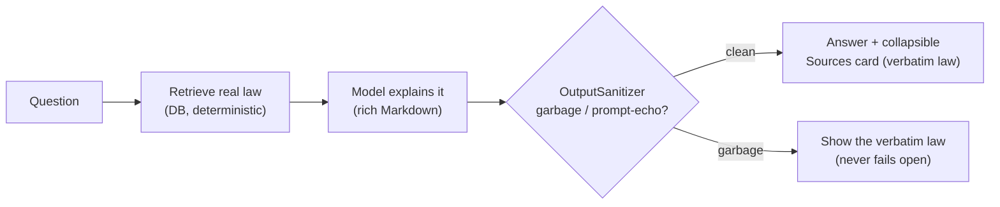

# 🤝 Contributing to Janadhikar

**[🏠 README](README.md)** · **[📐 Architecture](ARCHITECTURE.md)** · **🤝 Contributing** · **[📚 Knowledge](knowledge_database.md)** · **[🧠 Cognee](COGNEE.md)**

Thank you for helping build a tool people will rely on in stressful moments.
That sentence is the design constraint behind every rule here.

**A misleading answer is worse than a slow one.** So the guiding principle is
**grounding + honesty**: give a genuinely helpful, readable answer, but keep the
*exact verified law* one tap away and never let a small model's garbage reach the
user.

> 📐 Read **[ARCHITECTURE.md](ARCHITECTURE.md)** first — it has the diagrams for
> every flow referenced below.

---

## 🧭 The philosophy (how it changed)

The project started as a strict "translate-verbatim-only, zero-network" tool. It
evolved — based on real user testing — into a **rich, grounded, distributable**
assistant. Contributions must respect the *current* model:



---

## ☑️ The rules (non-negotiable)

### Rule 1 — Answers are grounded; the verified law is always available
The model may explain, quote, and reference articles/cases to be genuinely
useful — but every answer **must** be backed by the retrieved provision(s), and
the **exact verbatim law** must be shown in the collapsible *Sources* card.
- The grounded prompt lives in **one place**: `llm/PromptContract.kt`. Its
  `build*` functions inject exactly one free-text field: `VerbatimStatuteText`
  (from the DB). A structural test enforces this — don't add a raw-`String`
  parameter that reaches a grounded prompt.
- The dictionary "meaning of a word" helper is the *only* deliberate free-text
  path, and it is clearly labelled as a plain-language definition, not law.

### Rule 2 — Citation metadata flows from typed DB rows, verbatim
The Sources card (statute / section / page / source URL) is populated **only**
from typed fields on the SQLite row — never parsed out of model output.
```kotlin
CitationCard(statute = row.statuteName, section = row.sectionNumber, page = row.pageNumber) // ✅
val section = llmResponse.extractSectionNumber()   // ❌ instant rejection
```

### Rule 3 — Never fail open
If retrieval finds nothing confident → the refusal string
*"No verified legal statute found. Do not speculate."* If the model errors, times
out, or emits repetitive/prompt-echo garbage (`OutputSanitizer`), the app shows
the **verbatim law**. Do not add a path that lets the model answer with no
retrieved provision behind it.

### Rule 4 — The knowledge base is read-only at runtime, sacred at build time
- The app **never** writes to `janadhikar_knowledge.db`.
- Every row traces to an official source (India Code / Gazette / Constitution),
  with `source_document`, `page_number`, `source_url`, `compilation_date`.
- Pipeline changes (`knowledge-pipeline/`) need a source-checked review.

### Rule 5 — Network is used for EXACTLY one thing
- `INTERNET` is permitted **only** for the one-time first-run model download
  (a link-shared APK can't use `adb push`). **No** analytics, crash reporting,
  telemetry, remote config, or ad SDKs — ever.
- **Inference is 100% on-device.** No query, transcript, or answer may leave the
  phone. A dependency that phones home for anything else is rejected.

### Rule 6 — The native path is gated on CPU capability
ggml is compiled with ARM **dot-product** kernels for speed. Those SIGILL on CPUs
without them, so `CpuFeatures.hasDotProd` gates llama.cpp/whisper at runtime.
Any change to the native build or model loading must preserve this gate (old
phones fall back to Gemma / verbatim, never crash).

### Rule 7 — Hindi & Hinglish are first-class
- Every user-facing string ships in English **and** Hindi (`values/` + `values-hi/`).
- A Hinglish query (`article 15 kya hain`) must resolve to a Hindi answer
  (`QueryNormalizer` detects it).
- Voice must be tested with Hindi + code-switched speech.

---

## 🚨 Reporting a factual inaccuracy (Priority Zero)
Found a wrong statute/section/page, or an answer that misstates the law?
1. Open an issue `[FACTUAL] <description>`.
2. Include the query, the shown Sources card, and the correct citation with an
   official link.
3. Factual issues are triaged before all features and bugs.

---

## 🔀 Development workflow

```bash
git clone --recurse-submodules git@github.com:FiscalMindset/JanAdhikar.git
./gradlew :app:testDebugUnitTest        # unit tests
./gradlew :app:assembleDebug            # builds native + APK
```

- **Branches:** `feat/<area>-<summary>`, `fix/<area>-<summary>`, `kb/<statute>-…`.
- **Commits:** Conventional Commits (`feat:`, `fix:`, `kb:`, `docs:`). `kb:`
  commits reference the source document.
- **Style:** Kotlin official style (`ktlint`) + `detekt`; Compose only (no XML).
- **Threads:** no blocking work on the main thread; LLM/whisper run off `Default`
  where they'd starve the mic/UI (see `ChatEngine` voice fix).

### Tests by layer
| Layer | Required tests |
|---|---|
| `memory/` | metadata extraction, malformed rows, below-threshold → refusal; `DirectReference`, `MetaQuestion`, `HybridRetriever` |
| `llm/` | `PromptContract` single-injection structural guard; `OutputSanitizer` garbage/echo rejection |
| `engine/` | `ChatEngine` turn states; `ConversationStore`/`SessionArchive` round-trip; `FollowUp` |
| `input/` | language detection incl. Hinglish → Hindi |

### PR checklist
```markdown
- [ ] Grounded prompt still has a single VerbatimStatuteText injection (Rule 1)
- [ ] Sources metadata comes from typed DB fields (Rule 2)
- [ ] Never-fail-open paths intact: refusal / verbatim fallback (Rule 3)
- [ ] No runtime writes to the knowledge DB (Rule 4)
- [ ] Network only for the model download; no telemetry (Rule 5)
- [ ] Native CPU gate (CpuFeatures.hasDotProd) preserved (Rule 6)
- [ ] New strings exist in English AND Hindi (Rule 7)
- [ ] Tests added for the affected layer
```

---

## ⚖️ Scope boundaries (declined by default)
- Cloud sync, accounts, or a server component
- Telemetry / analytics / crash reporting / ads
- Sending any query or answer to a remote service
- Storing raw audio recordings
- New jurisdictions without a fully sourced knowledge-pipeline contribution (Rule 4)

---

*Janadhikar exists because someone will trust it completely at the worst moment
of their day. Build accordingly.*
