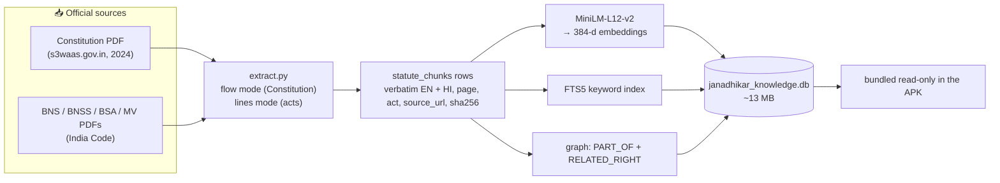
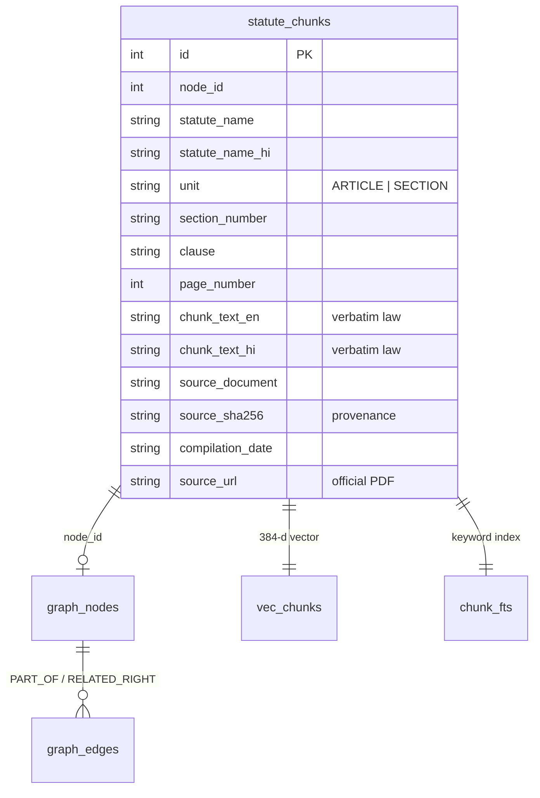

# 📚 Janadhikar — Knowledge & Data

**[🏠 README](README.md)** · **[📐 Architecture](ARCHITECTURE.md)** · **[🤝 Contributing](CONTRIBUTING.md)** · **📚 Knowledge** · **[🧠 Cognee](COGNEE.md)**

> The complete catalogue of **what law the app knows, exactly where every byte
> came from, and how it was built.** If the app can cite it, it is described
> here with its official source URL. If it is not here, the app refuses to
> answer rather than guess.

*Everything below is generated from the shipped database
(`app/src/main/assets/db/janadhikar_knowledge.db`) and the build manifest
(`knowledge-pipeline/corpus/manifest.json`), verified on **2026-07-03**.*

---

## 1. At a glance

| Metric | Value |
|---|---|
| **Statutes** | 5 |
| **Distinct provisions** | **1,742** (466 Constitution articles + 1,276 sections) |
| **Text chunks** | 1,994 (each with English **and** Hindi verbatim text) |
| **Graph nodes / edges** | 1,747 / 2,882 (`PART_OF` ×1,742, `RELATED_RIGHT` ×1,140) |
| **Database size** | ~13 MB (bundled in the APK, read-only) |
| **Embedder** | paraphrase-multilingual-MiniLM-L12-v2 → 384-dim |
| **Compiled** | 2026-07-03 · manifest SHA-256 `384453e2…30b110` |

---

## 2. The sources — every statute & its official PDF

All text is extracted from **official Government of India publications**. Nothing
is paraphrased, scraped from third parties, or model-generated.

| # | Statute (EN) | Act No. | Provisions | Chunks | Official source PDF |
|---|---|---|---|---|---|
| 1 | **Constitution of India** | — | 466 articles | 466 | [cdnbbsr.s3waas.gov.in…20240716890312078.pdf](https://cdnbbsr.s3waas.gov.in/s380537a945c7aaa788ccfcdf1b99b5d8f/uploads/2024/07/20240716890312078.pdf) |
| 2 | **Bharatiya Nyaya Sanhita, 2023** (BNS) | 45 of 2023 | 358 sections | 398 | [indiacode.nic.in…/a202345.pdf](https://www.indiacode.nic.in/bitstream/123456789/20062/1/a202345.pdf) |
| 3 | **Bharatiya Nagarik Suraksha Sanhita, 2023** (BNSS) | 46 of 2023 | 531 sections | 628 | [indiacode.nic.in…/the_bharatiya_nagarik_suraksha_sanhita,_2023.pdf](https://www.indiacode.nic.in/bitstream/123456789/21544/1/the_bharatiya_nagarik_suraksha_sanhita,_2023.pdf) |
| 4 | **Bharatiya Sakshya Adhiniyam, 2023** (BSA) | 47 of 2023 | 170 sections | 182 | [indiacode.nic.in…/aa202347.pdf](https://www.indiacode.nic.in/bitstream/123456789/20063/1/aa202347.pdf) |
| 5 | **Motor Vehicles Act, 1988** | 59 of 1988 | 217 sections | 320 | [indiacode.nic.in…/a1988-59.pdf](https://www.indiacode.nic.in/bitstream/123456789/9460/1/a1988-59.pdf) |

> **Publishers:** the Constitution PDF is the Government of India's **consolidated
> 2024** edition (hosted on `s3waas.gov.in`, the National Informatics Centre's
> government cloud). The four codes are the authenticated bare-acts from
> **[India Code](https://www.indiacode.nic.in/)** (Legislative Department,
> Ministry of Law & Justice). BNS/BNSS/BSA replaced the IPC/CrPC/Evidence Act
> from **1 July 2024**.

### These same PDFs ship inside the app
So "📄 Read the official law" works **offline**, the source PDFs are bundled and
opened in-app at the cited page:

| In-app file | Size | Statute |
|---|---|---|
| `assets/pdf/constitution.pdf` | 2.3 MB | Constitution of India |
| `assets/pdf/bns.pdf` | 0.9 MB | Bharatiya Nyaya Sanhita |
| `assets/pdf/bnss.pdf` | 2.0 MB | Bharatiya Nagarik Suraksha Sanhita |
| `assets/pdf/bsa.pdf` | 0.5 MB | Bharatiya Sakshya Adhiniyam |
| `assets/pdf/motor_vehicles.pdf` | 1.2 MB | Motor Vehicles Act, 1988 |

---

## 3. How the data flows (build-time → APK)



- **`flow` mode** (Constitution) handles the single-line-per-page PDF layout and
  the `N. Title.—` article headers.
- **`lines` mode** (the four codes) parses the `N. Heading.—(1)…` section layout,
  tolerant of em-dashes and Devanagari matras.
- Pipeline code: [`knowledge-pipeline/`](knowledge-pipeline/) — `build_db.py`,
  `pipeline/extract.py`, `corpus/manifest.json`.

---

## 4. Database schema

One SQLite file with three co-located indexes over the same rows.



**Tables:** `statute_chunks` (the law), `vec_chunks` (sqlite-vec, 384-d KNN),
`chunk_fts` (FTS5 keyword), `graph_nodes` / `graph_edges` (Cognee-flattened
graph), `kb_meta` (self-description), `room_master_table` (Room schema hash).

**Every citation field the UI shows comes straight from a typed column here** —
never from parsed model output (see [CONTRIBUTING.md](CONTRIBUTING.md) Rule 2).

---

## 5. Per-statute detail

| Statute | Unit | Provisions | Chunks | Max page | Source document (as stored) |
|---|---|---|---|---|---|
| Constitution of India | ARTICLE | 466 | 466 | 283 | `constitution_of_india.pdf (Govt. of India, consolidated 2024)` |
| Bharatiya Nyaya Sanhita, 2023 | SECTION | 358 | 398 | 110 | `a2023-45.pdf (indiacode.nic.in, Act 45 of 2023)` |
| Bharatiya Nagarik Suraksha Sanhita, 2023 | SECTION | 531 | 628 | 172 | `the_bharatiya_nagarik_suraksha_sanhita,_2023.pdf (indiacode.nic.in, Act 46 of 2023)` |
| Bharatiya Sakshya Adhiniyam, 2023 | SECTION | 170 | 182 | 51 | `aa202347.pdf (indiacode.nic.in, Act 47 of 2023)` |
| Motor Vehicles Act, 1988 | SECTION | 217 | 320 | 98 | `a1988-59.pdf (indiacode.nic.in, Act 59 of 1988)` |

> Chunks > provisions because a long section spanning multiple PDF pages is split
> into several chunks that share the same `section_number` (better retrieval),
> while each still points at its own page.

---

## 6. Retrieval indexes (how a query finds a row)

| Index | Table | Powers |
|---|---|---|
| **Vector KNN** | `vec_chunks` (sqlite-vec, 384-d cosine) | semantic match — "police killed my brother" → murder |
| **Keyword** | `chunk_fts` (FTS5, `bm25`, title-weighted) | exact terms + the crisis lexicon |
| **Graph** | `graph_edges` | related provisions + superseded-law redirects |

- **Embedder:** `paraphrase-multilingual-MiniLM-L12-v2`, **384-dim**, exported to
  TFLite (LiteRT). Tokenizer: SentencePiece unigram (Viterbi) reimplemented in
  pure Kotlin — vocab `assets/models/spm_vocab.tsv` (9 MB), bundled.
- **Graph relations:** `PART_OF` ×1,742 (every provision → its act),
  `RELATED_RIGHT` ×1,140 (cross-links between related provisions).

See [ARCHITECTURE.md §4](ARCHITECTURE.md#4-answering-a-question--the-routing-brain)
for the full hybrid retrieval flow.

---

## 7. Provenance & verification

Every row is auditable back to its source:

- **`source_url`** — the official PDF (the URLs in §2).
- **`source_document`** — human-readable citation (`a2023-45.pdf (indiacode.nic.in, Act 45 of 2023)`).
- **`page_number`** — the exact page, used by the in-app PDF viewer.
- **`source_sha256`** — hash of the source, so tampering is detectable.
- **`compilation_date`** — when the row was compiled (`2026-07-03`).
- **`kb_meta.corpus_manifest_sha256`** — `384453e2915c654cc44607a6235f83a81af4200c71338ad92a73bc298930b110`,
  binding the DB to an exact manifest.

The app additionally runs `PRAGMA query_only = 1` and a SELECT-only DAO — it can
**never write** to the knowledge base at runtime.

---

## 8. What is *not* here (and why the app refuses)

The corpus is deliberately bounded to the five statutes above. The app does
**not** know case law text, state amendments, other central acts, or personal
laws. When retrieval finds nothing confident, it says:

> *"No verified legal statute found. Do not speculate."*

Adding a statute means a fully-sourced `knowledge-pipeline` contribution
([CONTRIBUTING.md](CONTRIBUTING.md) Rule 4) — new law only enters via an official
PDF, page-checked, with all provenance columns filled.

---

## 9. Rebuilding the database

```bash
cd knowledge-pipeline
python -m venv .venv && source .venv/bin/activate
pip install -r requirements.txt
python build_db.py                       # PDFs (corpus/) → build/janadhikar_knowledge.db
cp build/janadhikar_knowledge.db ../app/src/main/assets/db/
```

The manifest (`corpus/manifest.json`) lists each act's `source_url`, extraction
`mode`, and expected structure. See also [COGNEE.md](COGNEE.md) for the
graph-compilation step and [knowledge_database.md](knowledge_database.md) for the
product-level description.
