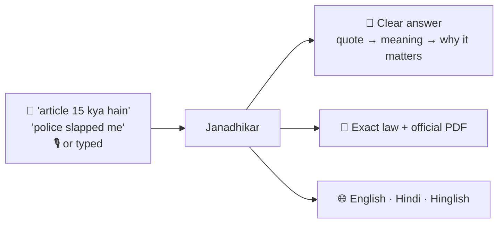

<div align="center">

# ⚖️ Janadhikar — जनाधिकार

### *Your rights. In your own words. On your phone.*

**An on-device AI legal assistant for Indian citizens — ask about your rights by
typing or speaking (English · Hindi · Hinglish) and get a clear, grounded answer
with the exact law behind it.**

<br/>


<br/><br/>

<table>
<tr>
<td align="center" width="33%">
<h3>🔒 Private by design</h3>
Every question, transcript &<br/>answer stays on the device.<br/>Network is used <b>once</b> — to download the model.
</td>
<td align="center" width="33%">
<h3>⚡ Fast & offline</h3>
Sub-second retrieval from a<br/>local law database; the AI<br/>runs on-device after setup.
</td>
<td align="center" width="33%">
<h3>📜 Grounded in real law</h3>
Every answer links to the<br/><b>exact bare-act text</b> +<br/>the official PDF at the right page.
</td>
</tr>
</table>

**🏠 README** · **[📐 Architecture](ARCHITECTURE.md)** · **[🤝 Contributing](CONTRIBUTING.md)** · **[📚 Knowledge](KNOWLEDGE.md)** · **[🧠 Cognee](COGNEE.md)**

</div>

---

## ✨ What it does



- **Ask anything, any way** — type or speak; English, Hindi, or **Hinglish**
  (`article 15 kya hain` → answered in Hindi).
- **Rich, ChatGPT-style answers** — the exact wording quoted, what it means in
  simple words, how it's interpreted, and why it matters — rendered as decorative
  Markdown (bold, blockquotes, highlights).
- **Always shows the real law** — a collapsible **Sources** card with the verbatim
  section, page, and a **"📄 Read the official law"** button that opens the
  government PDF **in-app at the exact page**.
- **Smart routing** — `article 21`, `section 302`, `fundamental rights`,
  `how many articles`, or `explain this simpler` are each handled the right way.
- **📖 Constitution overview** — dates, drafters (Dr. B. R. Ambedkar), the
  original-vs-today structure table, the three pillars, borrowed sources.
- **🕘 History**, **✎ new chat**, **select-a-word → meaning**, **copy**, and a
  **model picker** (Fast / Balanced / Gemma).
- **Never fails open** — if the model errors or times out, you still get the
  **exact verified law**, never a hallucination.

---

## 🚀 Try it

### Option A — install the APK (for users / testers)

1. Download `app-debug.apk` and install it (allow *install from unknown sources*).
2. Open it **once on WiFi** — it downloads the ~350 MB AI model with a progress bar.
3. Done — it now works **fully offline**. Type or tap the mic and ask.

> First run needs internet + ~1 GB free storage. After that, no network is used.

### Option B — build from source (for developers)

```bash
git clone --recurse-submodules git@github.com:FiscalMindset/JanAdhikar.git
cd JanAdhikar
./gradlew :app:assembleDebug            # builds native (llama.cpp + whisper.cpp + sqlite-vec)
adb install app/build/outputs/apk/debug/app-debug.apk

# Optional: push models over USB instead of downloading in-app
HF_TOKEN=hf_xxx ./scripts/fetch_models.sh
./scripts/push_models.sh
```

---

## 🤖 The models (pick one in Settings)

| Model | Runtime | Download | Speed | Best for |
|---|---|---|---|---|
| **⚡ Fast — Qwen 2.5 0.5B** *(default)* | llama.cpp (CPU, Q4_0) | auto, ~350 MB | Quick | Everyday lookups, budget phones |
| **Balanced — Qwen 2.5 1.5B** | llama.cpp (CPU, Q4_0) | auto, ~1 GB | Moderate | Best Hindi, richest answers |
| **Gemma 3 1B / 4B** | MediaPipe (accelerated) | manual `.task` | Fast | Devices without CPU dot-product |

Speed comes from **Q4_0 repacking + Flash Attention + ARM dot-product kernels**
(≈ 4× faster than a naïve build). On CPUs without dot-product the app safely
falls back to Gemma / verbatim.

---

## 🧱 Tech stack

| Area | Technology |
|---|---|
| **UI** | Kotlin · Jetpack Compose · Material 3 |
| **LLM** | llama.cpp (Qwen 2.5 GGUF) · MediaPipe GenAI (Gemma) — via JNI |
| **Voice (STT)** | whisper.cpp (small, multilingual) |
| **Retrieval** | SQLite + **sqlite-vec** (vector KNN) + **FTS5** (keyword), fused in one native lib |
| **Embedder** | paraphrase-multilingual-MiniLM-L12-v2 → TFLite (LiteRT), pure-Kotlin SentencePiece |
| **Knowledge** | Offline Python pipeline over official India Code / Constitution PDFs |

See **[ARCHITECTURE.md](ARCHITECTURE.md)** for the full diagrams (startup, routing,
retrieval, model selection, voice, native build, distribution).

---

## 📚 The law inside

5 statutes · **~1,742 provisions** — the **Constitution of India** (466 articles),
**Bharatiya Nyaya Sanhita**, **Bharatiya Nagarik Suraksha Sanhita**, **Bharatiya
Sakshya Adhiniyam**, and the **Motor Vehicles Act, 1988** — all with verbatim
English + Hindi text, page numbers, and official source links.
See [`knowledge_database.md`](knowledge_database.md).

---

## 🔐 Privacy & honesty

- **Your questions never leave the phone.** The only network call is the one-time
  model download from Hugging Face.
- **Grounded, not fabricated.** Answers are built from the retrieved law; the
  exact verified text is always one tap away; if the model produces garbage, the
  app shows the raw law instead.
- **Auditable.** The manifest, the prompt builder (`PromptContract`), and the
  output guard (`OutputSanitizer`) are small and reviewable.

---

<div align="center">
<sub>Built to put justice information in every hand. ⚖️</sub>
</div>
