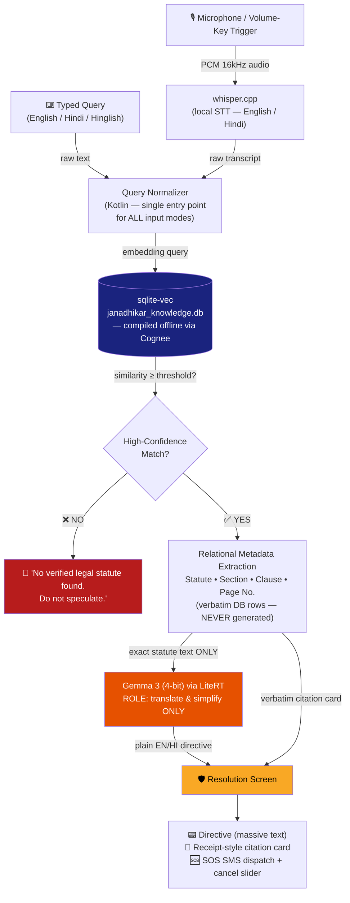

<div align="center">


# ⚖️ Janadhikar — जनाधिकार

### *Your Rights. Offline. Instant. Verified.*

**A 100% offline, zero-latency legal rights shield for citizens in hostile situations.**

<br/>


<br/><br/>

<table>
<tr>
<td align="center" width="33%">
<h3>🔇 Zero Network</h3>
No internet permission.<br/>Ever. Verifiable in the manifest.
</td>
<td align="center" width="33%">
<h3>⚡ Zero Latency</h3>
Sub-second retrieval from a<br/>local deterministic database.
</td>
<td align="center" width="33%">
<h3>🎯 Zero Hallucination</h3>
Every citation traced to a<br/>relational database row.
</td>
</tr>
</table>

</div>

---

## 📖 The Mission

When a citizen faces an unlawful detention, an illegal eviction, a wrongful vehicle seizure, or an aggressive interrogation, they have **seconds** — not minutes — to know their rights. There is no time to Google. There may be no signal at all. There is definitely no room for an AI that *invents* a statute.

**Janadhikar** (Hindi: *"People's Rights"*) is an Android application that listens to the situation unfolding around the user, matches it against a **pre-compiled, verified legal knowledge base**, and displays an actionable directive — in **English or Hindi** — backed by the *exact* statute, section, and page number from official legal texts.

> 🛡️ **The app is a shield, not an oracle.** It never generates legal facts. It only retrieves, translates, and simplifies them.

---

## 🧠 The "Zero Hallucination" Architecture

Most AI legal apps fail in exactly the moment they are needed most: they hallucinate a section number, cite a repealed act, or invent a right that does not exist. Janadhikar makes this **architecturally impossible** through strict separation of concerns:

<table>
<tr>
<th align="left" width="30%">Layer</th>
<th align="left" width="35%">Responsibility</th>
<th align="left" width="35%">What it is FORBIDDEN to do</th>
</tr>
<tr>
<td><b>🗄️ SQLite + sqlite-vec</b><br/><i>(Deterministic Memory)</i></td>
<td>Stores verified statute text, section numbers, clause IDs, and page numbers. Serves vector search + exact relational lookups.</td>
<td>Nothing is generated here. This layer is compiled offline via <a href="https://github.com/topoteretes/cognee">Cognee</a> from official legal PDFs and is <b>read-only at runtime</b>.</td>
</tr>
<tr>
<td><b>🎙️ whisper.cpp</b><br/><i>(Ears)</i></td>
<td>Real-time on-device transcription of English & Hindi speech.</td>
<td>Never interprets. Raw transcript only.</td>
</tr>
<tr>
<td><b>🤖 Gemma 3 via LiteRT</b><br/><i>(Translator, NOT Lawyer)</i></td>
<td>Receives the <b>exact retrieved statute text</b> and rewrites it as a simple English/Hindi directive.</td>
<td><b>FORBIDDEN</b> from generating section numbers, page numbers, citations, or any legal fact from parametric memory. All metadata is injected verbatim from database rows.</td>
</tr>
</table>

### The Golden Rule

```
IF sqlite-vec returns no high-confidence match:
    OUTPUT: "No verified legal statute found. Do not speculate."
    → The app would rather say nothing than say something wrong.
```

---

## 🔄 Data Flow



**Read the diagram carefully:** the LLM (orange) receives *only* the retrieved text, and the citation card (yellow) is populated *directly* from the database (blue) — the two paths never merge until the screen. The LLM physically cannot corrupt the citation.

---

## 📱 The Three UI States

<table>
<tr>
<td align="center" width="33%">

### 1️⃣ Trigger

<pre>
┌─────────────────┐
│                 │
│    JANADHIKAR   │
│                 │
│   ╭─────────╮   │
│   │  ((🎙️)) │   │
│   │  PULSE  │   │
│   ╰─────────╯   │
│                 │
│  Hold Vol-Down  │
│   to activate   │
└─────────────────┘
</pre>

Massive high-contrast pulsing mic button (50% of screen). Hardware **volume-key trigger** for discreet, no-look activation. A **typed-query field** below the mic feeds the same pipeline — speech and text are equal citizens.

</td>
<td align="center" width="33%">

### 2️⃣ Active

<pre>
┌─────────────────┐
│ ● REC   00:07   │
│─────────────────│
│ "आप मुझे        │
│  हिरासत में     │
│  क्यों ले..."    │
│                 │
│ ▓▓ transcribing │
│─────────────────│
│ ⚙ Searching     │
│   statutes...   │
└─────────────────┘
</pre>

Auto-scrolling **large-font live transcript** from whisper.cpp with an agent status ticker showing the retrieval pipeline in real time.

</td>
<td align="center" width="33%">

### 3️⃣ Resolution — *The Legal Shield*

<pre>
┌─────────────────┐
│ ⚠ YOU HAVE THE  │
│ RIGHT TO KNOW   │
│ GROUNDS OF      │
│ ARREST          │
│─────────────────│
│ 🧾 BNSS, 2023   │
│    Section 47   │
│    Page 21      │
│─────────────────│
│ 🆘 SMS in 10s   │
│ [◄ slide cancel]│
└─────────────────┘
</pre>

Massive yellow/orange **directive**, receipt-style **verified citation card**, and an **SOS SMS** countdown with cancel slider.

</td>
</tr>
</table>

---

## 🛠️ Tech Stack

| Component | Technology | Why |
|---|---|---|
| **UI** | Kotlin + Jetpack Compose | Declarative 3-state machine, high-contrast theming, massive tap targets |
| **LLM Runtime** | Google **LiteRT** | Hardware-accelerated (NNAPI/GPU) 4-bit inference on-device |
| **Model** | **Gemma 3** (270M / 1B, 4-bit quantized) | Small enough for mid-range devices; used *only* for translation & simplification |
| **Input** | Typed text **+** **whisper.cpp** STT (JNI bindings) | Every input mode (keyboard, voice) converges on one normalized query path; whisper.cpp gives proven real-time EN/HI transcription, fully offline |
| **Vector Search** | **sqlite-vec** | Zero-dependency vector KNN inside SQLite — one file, one source of truth |
| **Knowledge Compilation** | **Cognee** *(offline, build-time)* | Extracts entities/relations from official legal PDFs into `janadhikar_knowledge.db` |
| **Persistence** | Room + SQLite | Type-safe access to the read-only knowledge base |

---

## 📂 Repository Layout

```
janadhikar/
├── app/                          # Android application module
│   └── src/main/
│       ├── kotlin/com/janadhikar/
│       │   ├── ui/               # Compose screens (Trigger / Active / Resolution)
│       │   ├── engine/           # Orchestration state machine
│       │   ├── input/            # Unified query intake (typed text + voice)
│       │   ├── stt/              # whisper.cpp JNI wrapper (feeds input/)
│       │   ├── llm/              # LiteRT Gemma 3 inference (translation-only)
│       │   ├── memory/           # Room + sqlite-vec DAO layer
│       │   └── sos/              # SMS dispatch
│       ├── assets/
│       │   ├── models/           # gemma3-*.tflite, ggml-*-whisper.bin
│       │   └── db/janadhikar_knowledge.db
│       └── AndroidManifest.xml   # ← NO android.permission.INTERNET
├── knowledge-pipeline/           # Offline Cognee compilation scripts (desktop)
├── docs/
├── README.md
└── CONTRIBUTING.md
```

---

## 🔒 Privacy Guarantees

<table>
<tr>
<td>✅</td><td><b>No <code>INTERNET</code> permission</b> — verifiable in <code>AndroidManifest.xml</code> and enforced by CI.</td>
</tr>
<tr>
<td>✅</td><td><b>No telemetry, no analytics, no crash reporting SDKs.</b> Nothing leaves the device, ever.</td>
</tr>
<tr>
<td>✅</td><td><b>Audio is never stored.</b> Transcription is streamed and discarded; only the session transcript lives in volatile memory.</td>
</tr>
<tr>
<td>✅</td><td><b>SOS SMS is user-controlled</b> — a visible countdown with a cancel slider before any message is dispatched.</td>
</tr>
</table>

---

## 🚀 Getting Started

```bash
# 1. Clone
git clone https://github.com/<org>/janadhikar.git && cd janadhikar

# 2. Fetch model artifacts (placed in app/src/main/assets/models/)
#    - gemma3-1b-it-int4.tflite        (LiteRT, 4-bit)
#    - ggml-small-q5_1.bin             (whisper.cpp, multilingual EN/HI)

# 3. Build the knowledge base (one-time, on a desktop — NOT on device)
cd knowledge-pipeline && python compile_knowledge.py --out ../app/src/main/assets/db/

# 4. Build & install
./gradlew :app:installRelease
```

> **Minimum device:** Android 8.0 (API 26), 4 GB RAM, arm64-v8a. Recommended: 6 GB RAM for the 1B model; the 270M model runs comfortably on 4 GB.

---

## ⚠️ Legal Disclaimer

Janadhikar surfaces verbatim text from official legal publications and simplifies it for accessibility. It is an **informational aid, not legal advice**, and does not create an attorney–client relationship. Laws change; the knowledge base carries a compilation date visible on every citation card. Always consult a qualified advocate.

---

<div align="center">

**Built for the citizen who has 10 seconds and zero bars of signal.**

*जानकारी ही सुरक्षा है — Knowledge is protection.*

[Contributing](CONTRIBUTING.md) · [Report an Inaccuracy](CONTRIBUTING.md#reporting-a-factual-inaccuracy-priority-zero)

</div>
